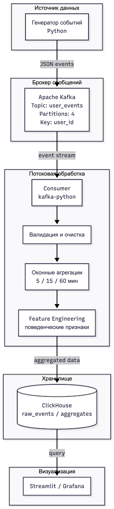
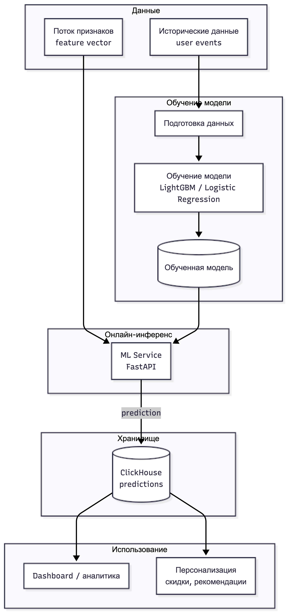

# Система потоковой аналитики пользовательских событий с онлайн-прогнозированием вероятности покупки

## Описание проекта
Проект представляет собой MVP системы для анализа пользовательского поведения в e-commerce в режиме реального времени.

Система обрабатывает поток пользовательских событий (просмотры, клики, добавления в корзину) и формирует поведенческие признаки, которые используются для аналитики и ML-прогнозирования вероятности покупки.

Реализован полный pipeline обработки данных:
генерация событий → Kafka → потоковая обработка → feature engineering → ML → ClickHouse → аналитика.

---

## Архитектура системы

Общий поток данных:

Event Generator → Kafka → Stream Processor → Feature Builder → ML → ClickHouse → Dashboard

---

## Архитектура потокового конвейера (Data Pipeline)

<p align="center">
  
</p>

Pipeline включает:
- генерацию пользовательских событий (synthetic data);
- передачу через Apache Kafka (topic: user_events);
- потоковую обработку данных (consumer);
- формирование stateful-признаков (сессии и пользовательская история);
- расчёт feature payload;
- вызов ML-модели для онлайн-прогнозирования;
- запись данных в ClickHouse;
- сохранение артефактов в jsonl (для дебага).

---

## Архитектура ML-пайплайна

<p align="center">
  
</p>

ML pipeline включает:
- генерацию синтетического датасета;
- обучение baseline-модели (логистическая регрессия);
- нормализацию и масштабирование признаков;
- сохранение артефактов модели (weights, scaler, schema);
- онлайн-инференс (predict module);
- расчёт вероятности покупки;
- визуализацию через Streamlit dashboard.

---

## Разделение проекта

Проект реализуется как совместная разработка с разделением на два направления:

### Data Pipeline (Data Engineering)
- генерация событий  
- Kafka producer / consumer  
- потоковая обработка  
- stateful-агрегации  
- feature engineering  
- интеграция с ML  
- запись в ClickHouse  

### ML Pipeline (Machine Learning)
- генерация датасета  
- обучение baseline-модели  
- feature contract  
- онлайн-инференс  
- объяснение предсказаний  
- визуализация (Streamlit)  

---

## Технологический стек

### Data Pipeline
- Python  
- Apache Kafka  
- kafka-python  
- ClickHouse  
- SQL  

### ML Pipeline
- Python  
- scikit-learn (baseline логистическая регрессия)  
- pandas / numpy  

### Общие инструменты
- Streamlit  
- Docker / Docker Compose  

---

## Статус проекта

Проект находится на стадии **рабочего MVP**.

### Реализовано:
- генерация событий;
- Kafka producer;
- Kafka consumer;
- потоковая обработка событий;
- stateful feature engineering (сессии + пользовательская история);
- формирование feature payload;
- онлайн-инференс ML-модели;
- запись в ClickHouse:
  - raw_events
  - feature_payloads
  - predictions
- сохранение данных в jsonl-файлы;
- baseline ML-модель:
  - обучение
  - сохранение артефактов
  - предсказание вероятности покупки;
- Streamlit dashboard.

### Планируется:
- оконные агрегации (5 / 15 / 60 минут);
- интеграция ML в поток (inline scoring);
- API слой (FastAPI);
- подключение Grafana;
- масштабирование Kafka (consumer groups, partitions).

---

## Структура репозитория

```
real-time-ecommerce-analytics/
├── producer/     # генерация событий и Kafka producer
├── processor/    # Kafka consumer и обработка потока
├── ml/           # модель, обучение и инференс
├── storage/      # ClickHouse клиент и схемы
├── api/          # backend/API (в разработке)
├── dashboard/    # Streamlit dashboard
├── docs/         # архитектурные схемы
├── config/       # конфигурация проекта
├── artifacts/    # результаты работы (jsonl, модели)
├── scripts/      # вспомогательные скрипты
├── tests/        # тесты
├── README.md
├── requirements.txt
└── docker-compose.yml
```

---

## Участники проекта

- **[AlexandrShadrukhin](https://github.com/AlexandrShadrukhin)** (Шадрухин Александр) — Data Pipeline / Data Engineering  
- **[PKS339057](https://github.com/PKS339057)** (Пряничников Кирилл) — ML Pipeline / Machine Learning  

---

## Запуск проекта

### 1. Запуск инфраструктуры
docker compose up -d

### 2. Установка зависимостей
pip install -r requirements.txt

### 3. Отправка событий в Kafka
python -m producer.kafka_producer

### 4. Запуск stream processing
python -m processor.stream_consumer

### 5. Проверка данных в ClickHouse
docker exec -it rtea-clickhouse clickhouse-client --user app --password app_password --query "SELECT count() FROM predictions"

---

## Репозиторий

Проект находится в стадии активной разработки MVP.
